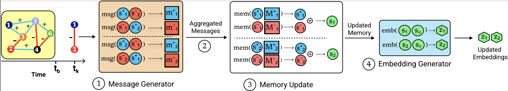

# Representation Learning in Continuous-Time Dynamic Signed Networks

Supplementary code for the work published at CIKM 2023. 

Paper link: [https://dl.acm.org/doi/10.1145/3583780.3615032](https://dl.acm.org/doi/10.1145/3583780.3615032)

Arxiv: [https://arxiv.org/abs/2207.03408](https://arxiv.org/abs/2207.03408)

## Citation

> @inproceedings{sharma2023representation,\
    title={Representation Learning in Continuous-Time Dynamic Signed Networks},\
    author={Sharma, Kartik and Raghavendra, Mohit and Lee, Yeon-Chang and Kumar M, Anand and Kumar, Srijan},\
    booktitle={32nd ACM International Conference on Information and Knowledge Management},\
    year={2023},\
    url={https://doi.org/10.1145/3583780.3615032}\
}

&nbsp;

## Local Reproduction and Protocol Audit

This branch, `exp/xgb-history`, adds a local experiment suite for auditing SEMBA on
BitcoinOTC-1 under two different temporal protocols:

1. **Strict online protocol**: for an event at time `t`, the model may only use
   events strictly before `t`; it predicts the current event first, then writes
   the current event into memory/history.
2. **Paper/public-code protocol**: this intentionally follows the old
   `train.py` path with `to_update=True`. In the public code, the current batch
   is written into memory/history before `mem2emb` predicts that same batch, so
   this protocol has batch-level information leakage risk. It should be treated
   as a reproduction/audit protocol, not as a strict online deployment protocol.

Key BitcoinOTC-1 `sign_class` findings from 5 seeds:

| Protocol | Model | Main result |
| --- | --- | --- |
| Strict online | XGB-all | `F1_macro=0.6970`, `F1_negative=0.4900`, `PR_AUC_negative=0.5472`, `AUROC=0.8235` |
| Strict online | SEMBA | `F1_macro=0.6524`, `F1_negative=0.4101`, `PR_AUC_negative=0.4096`, `AUROC=0.7505` |
| Strict online | TGN | `F1_macro=0.6606`, `F1_negative=0.4036`, `PR_AUC_negative=0.4087`, `AUROC=0.7257` |
| Paper/public-code | XGB with pair-history features | reaches `F1_bin=1.0000` and `AUROC=1.0000`, which is strong evidence of batch-inclusive leakage |
| Paper/public-code | SEMBA-emb64 | `F1_bin=0.8547`, `AUROC=0.7899`; close to the paper BTC-Otc reference `F1=0.81`, `AUROC=0.79` |
| Paper/public-code | TGN-emb64 | `F1_bin=0.8400`, `AUROC=0.8093`; close to the paper BTC-Otc reference `F1=0.74`, `AUROC=0.82` |

Interpretation: under the strict online setting, handcrafted temporal history
features with XGBoost are a very strong baseline and outperform the current
local SEMBA/TGN runners on negative-class metrics. SEMBA's signed memory and
long-term propagation remain useful relative to `semba-noprop`, but on this
strict BitcoinOTC-1 experiment SEMBA is not a stable, decisive improvement over
TGN. The paper/public-code protocol is useful for reproducing the historical
code path, but its results should not be used as causal online-prediction
evidence.

Experiment entry points and reports:

- Strict online comparison: `strict_xgb_comparison_experiment/`
- Paper/public-code protocol audit: `paper_protocol_sign_class_experiment/`
- Reusable runners: `experiments/run_xgb_paper_protocol.py`,
  `experiments/run_graph_paper_protocol.py`,
  `experiments/aggregate_paper_protocol_compare.py`
- Protocol tests: `tests/test_paper_protocol_features.py`
- Large raw result directories are intentionally ignored by `.gitignore`; the
  committed Markdown reports and small charts summarize the reproducible
  findings.

## Requirements
We use Python 3.8 for this implementation. Our code extensively uses the following 3 libraries: 
1. PyTorch 1.7 ([link](https://pytorch.org/get-started/locally/))
2. PyTorch Geometric ([link](https://pytorch-geometric.readthedocs.io/en/latest/notes/installation.html))

Follow the steps in the given links to install these libraries for your system configuration. 

A full set of requirements is given in `requirements.txt`, which can be used to create a conda virtual environment as:

> `conda create --name <env> --file requirements.txt`

## Data

We use these 4 datasets in this work:
1. BTC-OTC ([link](https://snap.stanford.edu/data/soc-sign-bitcoin-otc.html))
2. BTC-Alpha ([link](https://snap.stanford.edu/data/soc-sign-bitcoin-alpha.html))
3. WikiRFA ([link](https://snap.stanford.edu/data/wiki-RfA.html))
4. Epinions ([link](https://snap.stanford.edu/data/soc-sign-epinions.html)) 

These will be automatically downloaded and processed inside the root directory `data/`.

## Training the models
> `python train.py --model \<MODEL> --dataset \<DATASET> --task \<TASK>`

where we allow the following possibilities 

| | |
| -- | -- |
| MODEL | gcn, gat, sgcn, sigat, tgn, tgat, caw, sgclstm, semba |
| DATASET | BitcoinOTC-1, BitcoinAlpha-1, epinions, wikirfa |
| TASK | signlink_class, sign_class, link_pred |

**Example run:** `./run.sh`

In addition, we can tune other hyperparameters such as number of epochs, initial learning rate, embedding dimensions, negative weight, and so on. We provide the best run details of some of these in `best_run_details.csv` while we use the default parameters for others. 

Note that for Epinions dataset, pass the batch size as `--batch_size 16000`. 

**Running all methods:** `./run_baselines.sh`

**Saved models:** We also provide saved models for each model, dataset, and task triplet except for Epinions. Test performance can be found by simply running `python eval.py --model \<MODEL> --dataset \<DATASET> --task \<TASK>`. All saved models are provided at [https://drive.google.com/file/d/1LEtIYwY67NlJsmMXkepOX6fstO8HA8vM/view?usp=drive_link](https://drive.google.com/file/d/1LEtIYwY67NlJsmMXkepOX6fstO8HA8vM/view?usp=drive_link)
